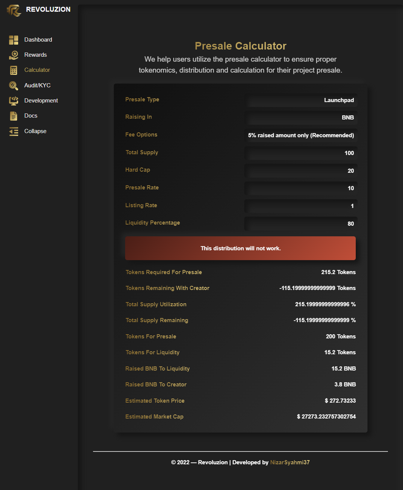

# Presale Calculator

## <mark style="color:yellow;">Revoluzion Presale Calculator</mark>

Revoluzion's presale calculator is a tool that helps you determine the amount of tokens you need to distribute in your presale. It asks for input on a number of variables, such as the number of tokens being sold, the price of each token, and the percentage of tokens being sold in the presale. Based on this information, the calculator can estimate the total number of tokens needed for the presale and the number of tokens each investor will receive.

To use the Revoluzion presale calculator, you need to have a clear understanding of the details of your token presale, including the number of tokens being sold, the price of each token, and the percentage of tokens being sold in the presale. You should also know the total number of tokens that will be available after the presale, as well as any bonuses or discounts that may be offered to presale investors. With this information, you can use the calculator to set up your presale and ensure that the token distribution is correct.

The Revoluzion calculator also checks the information you enter to ensure that the token distribution will work for the type of presale you have selected. If the calculation is not correct, the calculator will alert you to this. By using the Revoluzion presale calculator, you can ensure that your presale is properly set up and that the token distribution is correct.

### <mark style="color:yellow;">How To Use Revoluzion Presale Calculator?</mark>

Using Revoluzion's presale calculator is straightforward and easy. To get started, simply input the relevant data into the calculator, including the number of tokens being sold, the price of each token, and the percentage of tokens being sold in the presale. The calculator will then check whether the tokenomics and distribution work or not.

If the distribution is correct, a hint tab will turn green and announce that the distribution works. If the distribution is not correct, the calculator will provide a message indicating that the distribution will not work.

To help you understand how to use the Revoluzion presale calculator, here's a step-by-step guide:

1. Go to the Revoluzion presale calculator page and enter the relevant data into the calculator.
2. Review the hint tab to see if the token distribution works or not. If the tab turns green, the distribution works. If the tab does not turn green, the distribution does not work.
3. Make any necessary adjustments to the data you entered to ensure that the token distribution works correctly.
4. Continue to review and adjust the data until the hint tab turns green and the distribution is correct.

By following these steps, you can easily use the Revoluzion presale calculator to ensure that your token distribution is set up correctly.

Here's a sample when token distribution works:

<figure><figcaption>
It will show green if it works
</figcaption></figure>

 

<figure><figcaption>
It will show red if it doesn't works
</figcaption></figure>

### <mark style="color:yellow;">Video Presale Calculator Guide Tutorial</mark>
