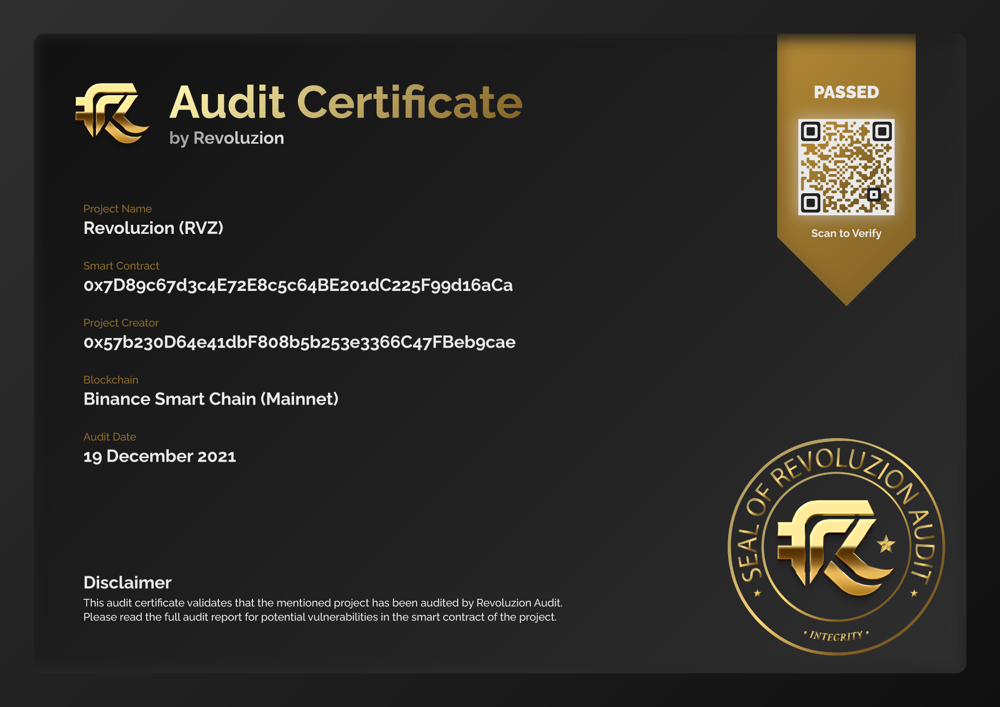

# Automated Token Creation

## <mark style="color:yellow;">Automated Instant Deployable Token</mark>

Revoluzion offers a variety of instant deployable tokens protocol for our users. To create their own token, users can simply connect to the Revoluzion dApp, connect their wallet, choose from the available token logics and structures, enter the required data, and deploy their token. The process is quick and easy, and users will receive their newly created token immediately upon deployment.

### <mark style="color:yellow;">Free Audit Report & Badge!</mark>

That's correct! When creating a token through the instant deployable feature on our dApp, users will receive a free audit report and audit badge on the Revoluzion launchpad platform. These are added automatically by our token creation smart contract, providing users with an extra level of assurance and credibility for their tokens.


If you are interested in obtaining a fully custom token smart contract from Revoluzion, please don't hesitate to contact us at [Revoluzion](https://t.me/revoluziontoken).&#x20;

We are here to help you get started with the token smart contract logics that meets your specific needs and requirements. Feel free to reach out to us today to discuss your project in more detail.


### <mark style="color:yellow;">Why Choose Revoluzion Automated Instant Deployable Token?</mark>

There are several reasons why users might choose Revoluzion's automated instant deployable token service:

1. <mark style="color:yellow;">Speed</mark>: With Revoluzion's service, users can create their own token in just a few minutes, rather than having to go through a lengthy and complex process.
2. <mark style="color:yellow;">Ease of use</mark>: The process of creating a token with Revoluzion is straightforward and user-friendly, making it accessible to people with a wide range of technical backgrounds.
3. <mark style="color:yellow;">Customization</mark>: Revoluzion's token creation dApp allows users to choose the token type and customize their tokens data according to their specific needs and requirements.
4. <mark style="color:yellow;">Security</mark>: Revoluzion's service is built on top of secure and reliable blockchain technology, ensuring the safety and integrity of users' tokens.
5. <mark style="color:yellow;">Support</mark>: Revoluzion provides support and assistance to users throughout the process of creating and managing their tokens with excellent after sale support.
6. <mark style="color:yellow;">Auto Verify</mark>: All Revoluzion instant token creations are automatically verified through our token creation tracker, and the contract source code is automatically verified by the Binance Smart Chain explorer. This ensures the integrity and security of the tokens created through our service.
7. <mark style="color:yellow;">Audit & Badge</mark>: All Revoluzion instant token creations come with a free audit from Revoluzion Audit. In addition, the presale audit badge will be automatically added to the presale page created by the token owner as soon as they create their presale.
8. <mark style="color:yellow;">Antibot</mark>: Revoluzion instant tokens come with an antibot system built into the token smart contract itself. Token owners can easily activate this feature through the Revoluzion antibot tab in the Revoluzion dApp.

Overall, Revoluzion's automated instant deployable token service offers users a convenient, fast, and secure way to create and manage their own tokens.

Revoluzion has the ability to develop smart contracts for all EVM chains using solidity and other languages such as Move and Rust. Our team is equipped to handle a wide range of projects and is committed to delivering the best possible solutions for our clients.

All Revoluzion token creation includes an Audit on-chain NFT Certificate for authenticity.

<figure><figcaption>
On-Chain Smart Contract Certificate
</figcaption></figure>

### <mark style="color:yellow;">Token Creation Rate & Time Frame</mark>

Since the token creation are automated and instant, the time frame are extremely fast and can be deployed within minutes by just connection wallet, adding a little data and done!

Revoluzion token creations are available on multiple EVM blockchains, and the rates vary based on the native value of each blockchain. For more detailed pricing information for token creation on each blockchain, please see the link below.


[presale-services-fee.md](../revoluzion-launchpad-protocol/presale-services-fee.md)

