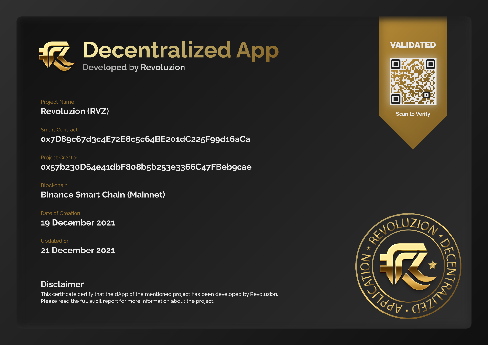

# DApp Development

## <mark style="color:yellow;">Decentralized Application</mark>

Revoluzion offers a variety of function dApps to fit your project needs. These dApps, particularly those that support dividends, rebasing, and games, are essential for token holders and potential investors as they provide valuable metadata directly within the dApp.

Revoluzion is capable of providing a complete dApp interface with multiple functional smart contracts integrated into the dApp.


If you are interested in obtaining a custom or ready-made dApp from Revoluzion, please don't hesitate to contact us at [Revoluzion](https://t.me/revoluziontoken).&#x20;

We are here to help you get started with the dApp that meets your specific needs and requirements. Feel free to reach out to us today to discuss your project in more detail.


### <mark style="color:yellow;">Why Choose Revoluzion DApp Development Services?</mark>

Revoluzion has the expertise and experience to customize dApps to meet the specific requirements of our clients. We are skilled at designing and developing optimized and secure dApps to ensure the best possible results for our clients.

Revoluzion uses NextJS typescript coding and our own Revoluzion API endpoints to build dApps that can access a wide range of data. Both ready-made and customized dApps are built with direct web3 connections for added security and functionality.

All Revoluzion developed dApps includes an on-chain NFT Certificate for authenticity.

<figure><figcaption>
On-Chain DApp Certificate
</figcaption></figure>

### <mark style="color:yellow;">DApp Development Rate & Time Frame</mark>

Revoluzion offers competitive pricing for dApp development on EVM chain/solidity, as well as other chains using languages such as Move and Rust. Our rates are designed to be competitive and provide value to our clients.

Ready made dApp with slight customization : <mark style="color:green;">**500 BUSD**</mark>

Ready made dApp with slight customization timeframe : Within 24 hours (depending on submission)

Custom made dApp : <mark style="color:green;">**1000 BUSD**</mark> onwards

Additional add on ready made features by Revoluzion such as swap interface etc : <mark style="color:green;">**200 BUSD**</mark> onwards

### <mark style="color:yellow;">DApp Development Flow</mark>

The process of Revoluzion developing a decentralized application (dApp) typically involves the following steps:

1. Discuss with the client and define the requirement or need that the dApp will solve.
2. Research and choose the appropriate coding structure for the dApp.
3. Design the dApp's user interface and user experience.
4. Implement the smart contracts that will govern the dApp's functionality.
5. Test the dApp thoroughly to ensure that it is functioning correctly and securely.
6. Deploy the dApp to the chosen blockchain platform.
7. Maintain and update the dApp as needed.

It's important to note that the development process for dApps can vary depending on the specific requirements and goals of the project.&#x20;

Clients have the option to request specific services such as server hosting, coding type, or just a dApp interface without smart contracts, depending on their needs.


Revoluzion offers a variety of utility dApps to our clients. Please take a look at our full range of services to see all the utility dApps we can provide.

