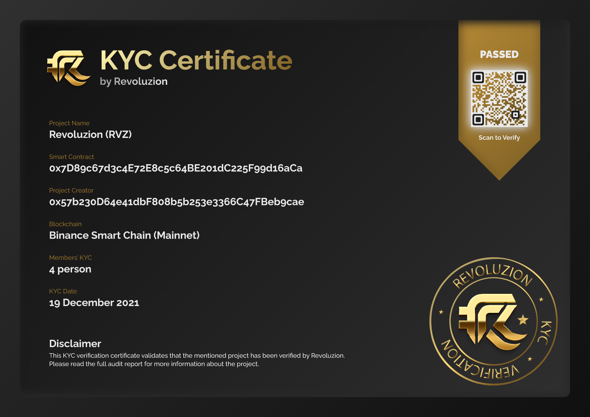

# KYC / KYB

## <mark style="color:yellow;">KYC / KYB Services</mark>

Revoluzion offers both Know Your Customer (KYC) and Know Your Business (KYB) services to create a secure environment for our users and the industry.&#x20;

Know Your Customer (KYC) is a process that involves verifying the identity of a customer or client and assessing their potential risks for scams and fraud. This process is crucial because it helps organizations comply with laws and regulations designed to prevent these illegal activities and to protect our users from them.


If you are interested in obtaining KYC or KYB certificate from Revoluzion, please don't hesitate to contact us at [Revoluzion](https://t.me/revoluziontoken).&#x20;

We are here to assist you with the (KYC) or (KYB) onboarding process. Please don't hesitate to contact us today to further discuss your project.


### <mark style="color:yellow;">Why Choose Revoluzion KYC / KYB Services?</mark>

At Revoluzion, we have the expertise and experience to conduct a comprehensive Know Your Customer (KYC) or Know Your Business (KYB) onboarding process. We are committed to delivering a thorough system by conducting live video calls and quick verification to ensure the legitimacy of our clients.&#x20;

We believe that obtaining a KYC certificate is essential for creating a safe and trustworthy environment in the industry. By requiring project owners to go through the KYC process, we can help support a cleaner and safer industry overall.


<mark style="color:yellow;">On-chain NFT Certificate!</mark> One of the benefits of choosing Revoluzion for your Know Your Customer (KYC) / Know Your Business (KYB) onboarding is receiving an on-chain Non-Fungible Token (NFT) certificate that is directly deployed from the Revoluzion deployer and can be verified through our dApp. This provides a high level of authenticity and reliability.


All Revoluzion KYC / KYB certificates includes an on-chain NFT Certificate for authenticity.

<figure><figcaption>
On-Chain Smart Contract Certificate
</figcaption></figure>

### <mark style="color:yellow;">KYC / KYB Certificate Rate & Time Frame</mark>

Revoluzion offers competitive pricing for Know Your Customer (KYC) and Know Your Business (KYB) certificates. We believe that project owners who verify their identity and business deserve fair pricing while also helping to make the industry safer.

KYC / KYB certificates : <mark style="color:green;">**200 BUSD**</mark>

Additional each team member certificates : <mark style="color:green;">**100 BUSD**</mark>

Timeframe : Veriff (5 mins) + video call interview (10mins)

### <mark style="color:yellow;">KYC / KYB Flow</mark>

Revoluzion KYC / KYB system has the ability to cover over 10k official IDs, in over 190 countries and 45 languages. Veriff is also compliant with CCPA, GDPR, SOC2 type II, ISO 27001, and WCAG Accessibility Guidelines.

After the artificial intelligence verification process is completed, Revoluzion will conduct a live video call interview to confirm its authenticity and request further verification if necessary.
