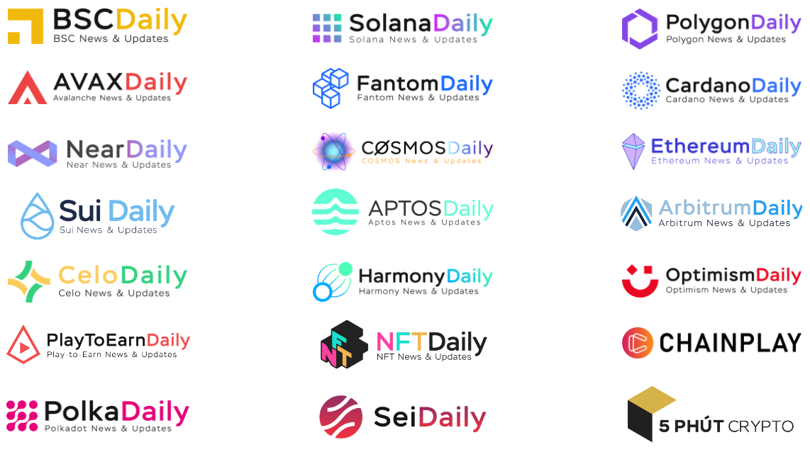

# Marketing Services

## <mark style="color:yellow;">Marketing Services</mark>

Revoluzion offers a range of marketing services to help clients promote their projects, products, or services. The specific approach taken will depend on the client's marketing goals and preferences. Some examples of marketing services that Revoluzion may provide include promotion on the Revoluzion launchpad platform, social media marketing, and advertising on the Revoluzion platform. Revoluzion will work with clients to determine the best approach for their specific needs


If you are interested in marketing your project through Revoluzion, please don't hesitate to contact us at [Revoluzion](https://t.me/revoluziontoken) anytime.

Marketing is often overlooked as a crucial factor in the success of a project, but it is an essential component for achieving success.


### <mark style="color:yellow;">Revoluzion Strategic Marketing Partnership</mark>

Revoluzion has also recently formed a strategic partnership with TK Media, a highly respected marketing agency in the crypto industry. Through this alliance, Revoluzion will be able to provide its clients with expert marketing support, including assistance with strategy development and recommendations on the most effective approaches.&#x20;

TK Media is known for its professionalism and track record of success in the crypto space, as demonstrated by its verified company account on Twitter. As a Revoluzion client, you can take advantage of competitive rates and discounts on TK Media's services.

Examples of TK Media marketing platform:&#x20;

<figure><figcaption>
Multi Selection Platform To Market
</figcaption></figure>

### <mark style="color:yellow;">What Can Revoluzion Marketing Service Do?</mark>

The goal of marketing the project is to increase public awareness and understanding of it. With so many projects competing for attention, effective marketing is crucial in order to stand out.&#x20;

The Revoluzion marketing team will thoroughly analyze the project data to determine the most effective marketing strategy and approach to use. This may involve a variety of tactics such as social media advertising, content marketing, influencer outreach, or other methods depending on the specific needs and goals of the project.

### <mark style="color:yellow;">How Will Revoluzion Market My Project?</mark>

Here are some steps that Revoluzion might take when marketing a client project:

1. <mark style="color:yellow;">Understand the client's goals and target audience</mark>: Revoluzion will work with the client to identify their marketing goals and the specific audience they want to reach.
2. <mark style="color:yellow;">Develop a customized marketing plan</mark>: Revoluzion will create a plan that is tailored to the needs and goals of the client's project. This might include tactics such as social media marketing, content marketing, or influencer outreach, depending on the specific needs of the project.
3. <mark style="color:yellow;">Create promotional materials</mark>: Revoluzion will develop marketing assets such as social media posts, website content, and other materials to help promote the client's project.
4. <mark style="color:yellow;">Implement the marketing plan</mark>: Revoluzion will use the channels and tactics identified in the marketing plan to reach and engage the client's target audience. This might include creating and distributing social media posts, running online ads, or working with influencers to promote the project.
5. <mark style="color:yellow;">Measure and analyze results</mark>: Revoluzion will track the effectiveness of the marketing efforts and use analytics tools to identify areas for improvement for future marketing.


These are just general guidelines, and the specific approach taken will depend on the needs and goals of the client's project.


### <mark style="color:yellow;">Revoluzion Marketing Services Rate & Time Frame</mark>

To view Revoluzion's Launchpad marketing services rates and timeframes, please click the following link for a complete list:


[additional-services-fee.md](../revoluzion-launchpad-protocol/additional-services-fee.md)


### <mark style="color:yellow;">TK Media Sales Pitch Deck</mark>

Click on the links of the marketing chain you want to view, and you will find all of the rates listed within the pitch deck.&#x20;


Revoluzion clients that utilize any of Revoluzion services are entitled to a 10% discount on the rates listed in the pitch deck, while non-client are subject to 5% discount.


[BSC Daily   ](https://coinwire.com/services/bsc-daily/)

[Ethereum Daily   ](https://coinwire.com/services/other-channels/)

[Aptos Daily   ](https://coinwire.com/services/other-channels/)

[Arbitrum Daily  ](https://coinwire.com/services/other-channels/) 

[Celo Daily   ](https://coinwire.com/services/other-channels/)

[ChainPlay  ](https://coinwire.com/services/chainplay/) 

[Cosmos Daily  ](https://coinwire.com/services/other-channels/) 

[Avax Daily   ](https://coinwire.com/services/avax-daily/)

[Cardano Daily   ](https://coinwire.com/services/cardano-daily/)

[Fantom Daily   ](https://coinwire.com/services/fantom-daily/)

[Near Daily  ](https://coinwire.com/services/other-channels/) 

[PlayToEarn Daily  ](https://coinwire.com/services/other-channels/) 

[Polka Daily  ](https://coinwire.com/services/other-channels/) 

### <mark style="color:yellow;">Disclaimer</mark>


The success of a marketing campaign for a project depends on the quality and appeal of the project itself and the willingness of users to engage with and invest in it.&#x20;

Revoluzion cannot be held responsible for any unfavorable outcomes in terms of project  performance.

