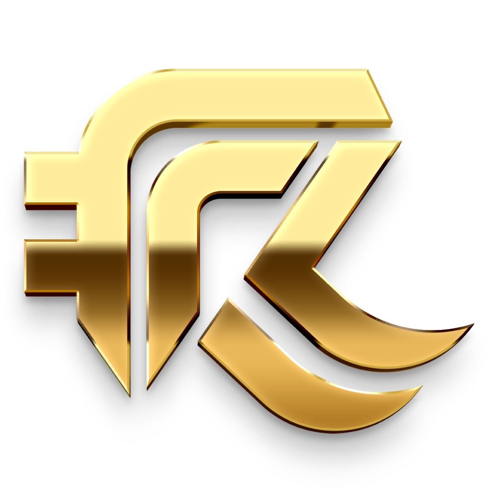
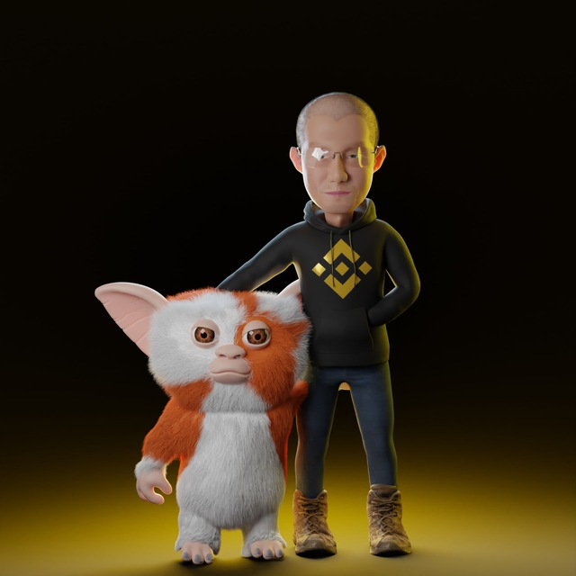
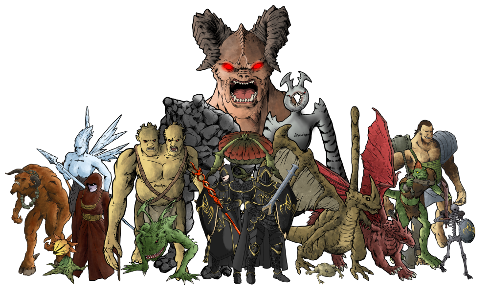

# NFT Design / Sketch Artwork

## <mark style="color:yellow;">NFT Design / Sketch Artwork Introduction</mark>

Welcome to Revoluzion NFT and Sketch design, where we offer a unique blend of 3D NFT artwork and 2D sketch art for our clients. Our team of talented artists are dedicated to creating innovative and eye-catching pieces that are sure to impress.&#x20;

Our 3D NFT artwork is perfect for collectors and enthusiasts looking to add a touch of digital art to their collection. Our 2D sketch art is great for those looking for a more traditional, hand-drawn look. No matter what your preference, we have something for everyone at Revoluzion. Thank you for considering us for all of your art needs.


If you're seeking an impressive 2D/3D design or sketch artwork, Revoluzion is here to help. Please don't hesitate to contact us at [Revoluzion](https://t.me/revoluziontoken) anytime.

Revoluzion's designers have a decade of experience and have completed major designs for major global brands.


### <mark style="color:yellow;">What Is The Difference Between 3D NFT And 2D Artwork?</mark>

3D NFT artwork is a digital form of art that is created using 3D graphics software and is mostly used as NFT and stored on a IPFS blockchain. It is often used for creating immersive and interactive experiences, such as virtual reality or augmented reality artworks. 3D NFT artwork is unique in that it is non-fungible, meaning it cannot be exchanged for something else of equal value. This makes it a popular choice for collectors and investors.

On the other hand, 2D sketch artwork is a traditional form of art that is created using pencils, pens, or other drawing media on a flat surface. It is often used to create more realistic or lifelike depictions of subjects, and can be created in a wide range of styles and techniques. 2D sketch artwork is typically more accessible and affordable than 3D NFT artwork, as it does not require specialized software or hardware to create or display.

### <mark style="color:yellow;">3D NFT And 2D Artwork Rate & Time Frame</mark>

Revoluzion offers competitive pricing for 3D NFT And 2D Artwork. For the most accurate pricing, contact Revoluzion to request a quote for your specific design requirements. Prices may vary based on factors such as the size, complexity, and quantity of artwork needed

* 2D Sketch artwork NFT x 1 - <mark style="color:green;">**40 Busd**</mark>
* 2D Sketch artwork 1080p size x 1 - <mark style="color:green;">**100 Busd**</mark>
* 3D Design artwork NFT x 1 piece - <mark style="color:green;">**50 Busd**</mark>
* 3D Design Logo x 1 piece - <mark style="color:yellow;"></mark> <mark style="color:green;">**30 Busd**</mark>
* 3D Design artwork 1080p size x 1 - <mark style="color:green;">**120 Busd**</mark>
* 3D Design artwork NFT x 500 multi generated pcs - <mark style="color:green;">**900 Busd**</mark>

The time it takes to complete artwork design can vary based on factors such as the quantity and complexity of the design. A simple single logo or portrait-style 2D/3D NFT design may take just a few hours to a day to complete, depending on the specifics of the design


Designs tend to be more cost-effective when ordered in larger quantities, especially if they have a similar structure with only minor alterations in color or small additions.


### <mark style="color:yellow;">Sample Artworks</mark>

### <mark style="color:yellow;">Logos</mark>

<figure><figcaption></figcaption></figure>

### <mark style="color:yellow;">Sample NFT Artwork</mark>

<figure><figcaption></figcaption></figure>

### <mark style="color:yellow;">Sketch Artwork</mark>

<figure><figcaption></figcaption></figure>
