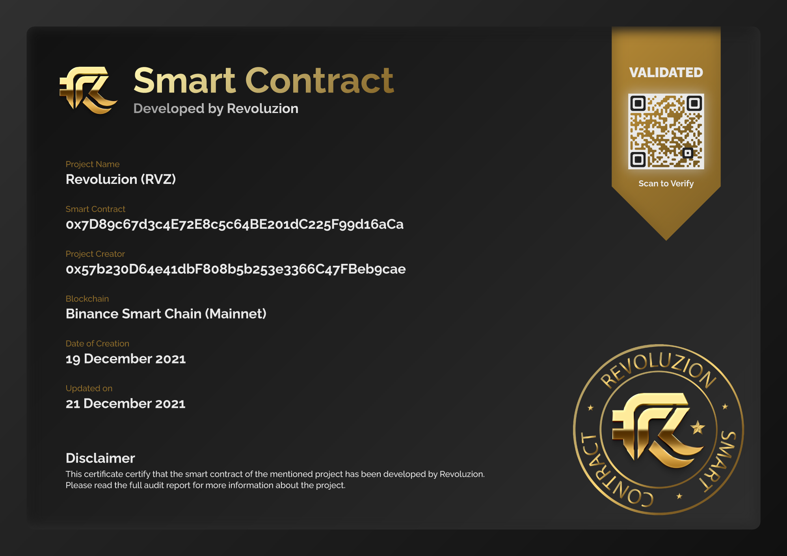

# Smart Contract Development

## <mark style="color:yellow;">Smart Contracts</mark>

Revoluzion provides a range of function smart contracts to suit the needs of your project. Our team is skilled in developing various types of smart contracts and logic, including automated rebasing, game contracts, staking, dividends, randomizers, complex algorithms and mathematics, escrow, non-fungible ERC721, ERC1155, and more. We are committed to delivering the best possible solutions for your project.


If you are interested in obtaining a fully custom smart contract from Revoluzion, please don't hesitate to contact us at [Revoluzion](https://t.me/revoluziontoken).&#x20;

We are here to help you get started with the smart contract logics that meets your specific needs and requirements. Feel free to reach out to us today to discuss your project in more detail.


### <mark style="color:yellow;">Why Choose Revoluzion Smart Contract Development Services?</mark>

At Revoluzion, we have the expertise and experience to code smart contract logics that meet the specific needs of our clients. We are dedicated to delivering high-quality solutions and are skilled at designing and developing optimized and secure smart contracts to ensure the best possible results for our clients.

Revoluzion has the ability to develop smart contracts for all EVM chains using solidity and other languages such as Move and Rust. Our team is equipped to handle a wide range of projects and is committed to delivering the best possible solutions for our clients.


<mark style="color:yellow;">Free Audit Report included!</mark> One of the best things about choosing Revoluzion for your smart contract development needs is that all of our contracts come with an audit report. We prioritize the security and integrity of our smart contracts and are committed to delivering the highest quality products to our clients.


All Revoluzion developed smart contracts includes an on-chain NFT Certificate for authenticity.

<figure><figcaption>
On-Chain Smart Contract Certificate
</figcaption></figure>

### <mark style="color:yellow;">Smart Contract Development Rate & Time Frame</mark>

Revoluzion offers competitive pricing for smart contract development on EVM chain/solidity, as well as other chains using languages such as Move and Rust. Our rates are designed to be competitive and provide value to our clients.

Ready made smart contracts for tokens are instantly deployable via our dApp.

Custom made smart contracts : <mark style="color:green;">**500 BUSD**</mark> onwards

Additional add on smart contracts : <mark style="color:green;">**300 BUSD**</mark> onwards

### <mark style="color:yellow;">Smart Contract Development Flow</mark>

The process of developing a smart contract typically involves the following steps:

1. Discussing with the client and define the requirements or needs that the smart contract will solve.
2. Research and choose the appropriate coding structure for the smart contract.
3. Design the smart contract's logic and functionality.
4. Write the code for the smart contract in the chosen programming language.
5. Test the smart contract thoroughly to ensure that it is functioning correctly and securely via Remix VM.
6. Deploy the smart contract to the testnet blockchain platform and do multiple testing.
7. Testing additional functions such as creating presale pool, finalizing and such.
8. Refine anything required and deliver to the client

After the initial development of the smart contract, Revoluzion will provide two additional revisition to refine and fine-tune anything that may be required to ensure that the final product meets the client's needs and expectations.&#x20;

At Revoluzion, we are dedicated to delivering the best possible results for our clients and are committed to refining and perfecting our work to ensure that the final smart contract is of the highest quality. Once all necessary refinements have been made, we will deliver the completed project to the client.
